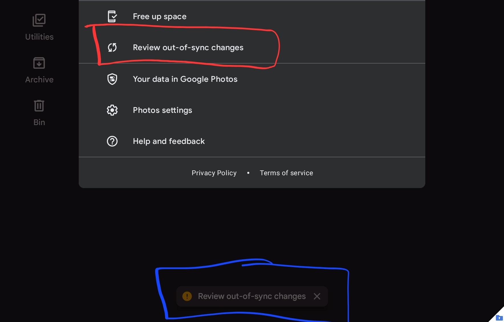
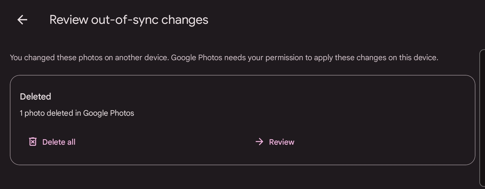
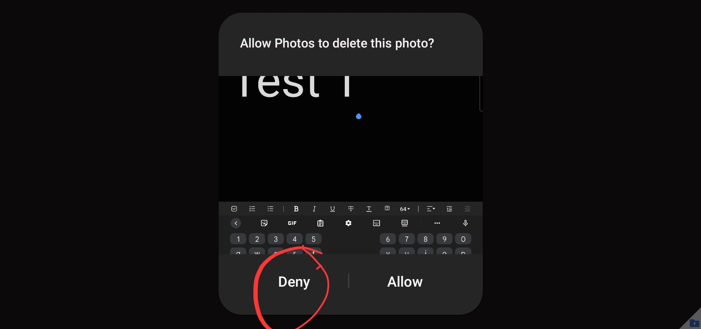
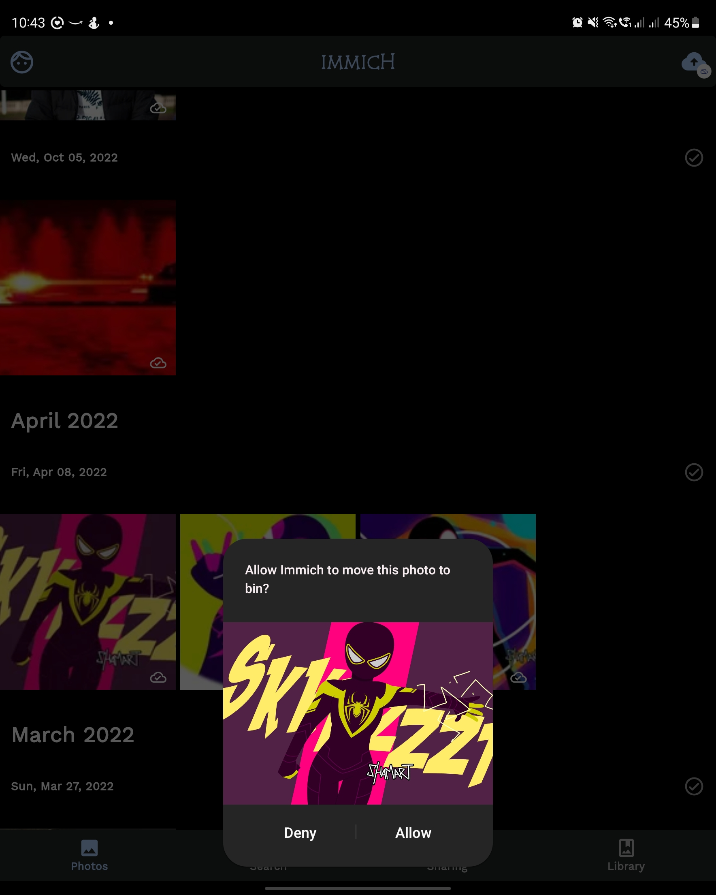
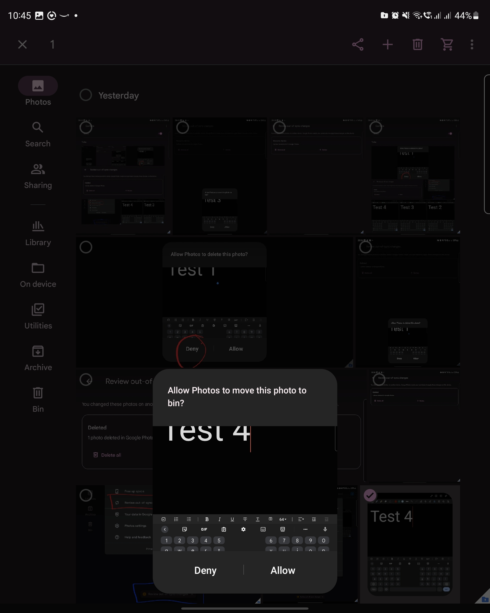

# How Google Deletes Assets

By default Google won't delete the item but instead move it to a bin folder. In terms of where the deleted asset is stored it is in the air, it could be on your device or on their cloud server. However, when Immich currently "deletes" an asset. That asset gets moved to a "bin" folder, that bin folder on android is a hidden folder somewhere and surprise surprise only Google Photos can view the hidden folder. So, either we need to have a look at an alternative package or api to completely remove an asset. No point of moving it to a hidden folder that the user can't see or immich can't view either.

When an asset that was uploaded on Android gets deleted and was sent to the bin or permanantly deletd after being added to the bin, the user will get a notification when they open up Google Photos. As seen below. There's a notification but also you find it when you click your profile asking you to review the changes.

However, the intereseting thing though, permanantly deleting an asset and moving it to the bin works in different ways.

### Permanantly deleting an asset

When an assets gets permenantly deleted on the web, Google Photos will notify you to review the changes. It will ask if you want to delete the asset from your device and you can either deny or accept. Accepting will also remove the asset from the device and denying won't delete it but also does not get rid of the notification. Also, that asset won't be reuploaded next time backup runs. So, basically denying won't no longer back up that asset and it seems like the only way is to back it up on the web.

Denying won't do anything here

### Asset moved to Bin folder

When user opens up Google photos they will be notified that the asset was moved to bin and if they want to also move the asset on their device to the bin or not. Denying to move the asset from the bin will move the asset back to photos and the notification will disappear. Deciding to move it to the bin, then that asset is "deleted" from the users device and it is moved to the bin folder. As mentioned, the pop up that immich uses to "delete" an asset is the same that Google photos uses to move the asset to the bin.

When I press yes on moving it to the Bin, the image will no longer be discoverable on the gallery on my phone. However, if I open up Google Photos and go to Bin, then there's the "deleted" image with the ability to recover it. This is the same when I don't have Google Photos installed. The images/videos gets moved to a hidden folder that only Google Photos can view.

Here is when I delete an image on Google Photos. Same prompt

